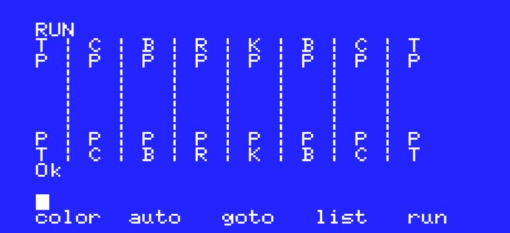
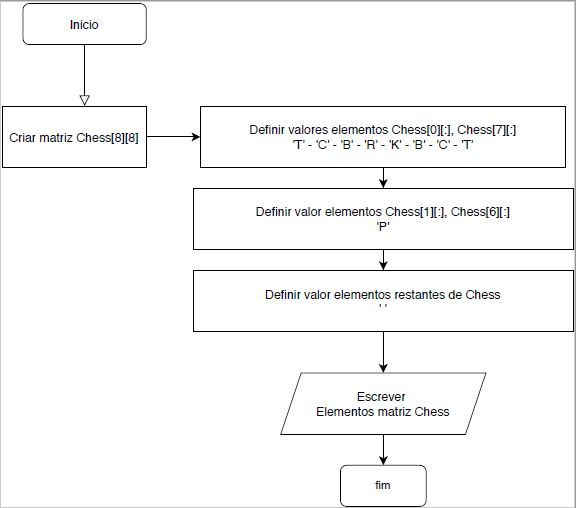

# Basic_SeveroNeto

-[Código do programa](Codigo/Cod_Basic.txt)

-Imagem do tabuleiro

-fluxograma

* Este programa basicamente printa todas as peças presentes em um jogo de tabuleiro apenas para demonstrar o funcionamento da linguagem BASIC, não estruturada.

